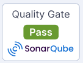
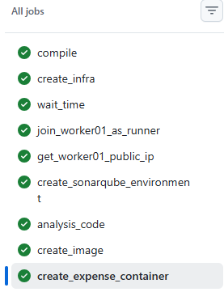
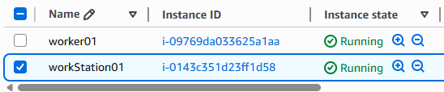
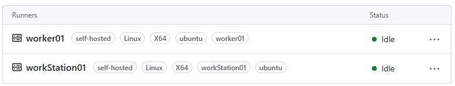
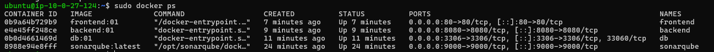
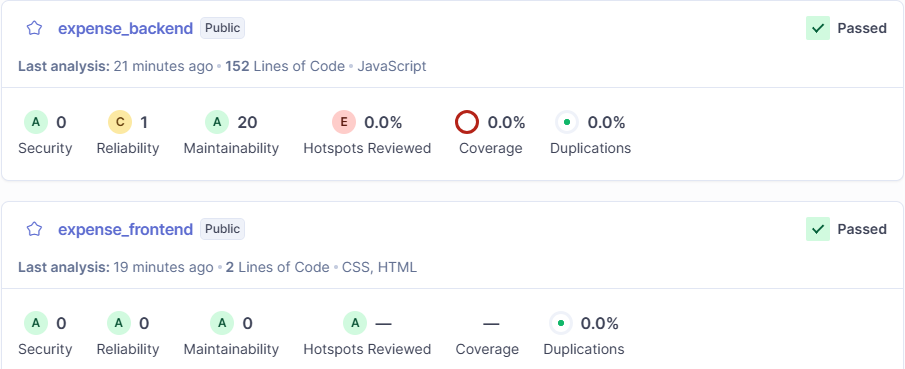
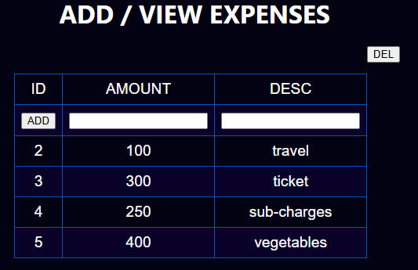

## Hi there 👋

<!--
**vikaskumars1997/vikaskumars1997** is a ✨ _special_ ✨ repository because its `README.md` (this file) appears on your GitHub profile.

Here are some ideas to get you started:

- 🔭 I’m currently working on ...
- 🌱 I’m currently learning ...
- 👯 I’m looking to collaborate on ...
- 🤔 I’m looking for help with ...
- 💬 Ask me about ...
- 📫 How to reach me: ...
- 😄 Pronouns: ...
- ⚡ Fun fact: ...
-->
# 👋 Hi, I'm Vikas Kumar

<p align="center">


</p>

---

## 🚀 About Me

- 🌱 Hands on experience on DevOps Tools
- ☁ AWS | Terraform | Kubernetes | Ansible | Docker | Sonarqube
- 🐧 Linux Administrator
- ⚡ Automation using Python
- 👀 Promethesu | Grafana | ELK 

---

## 🛠 Tech Stack

<p align="center">




</p>


---

## 📊 GitHub Stats

<p align="center">


</p>

---

## 👀 Visitor Count

<p align="center">


</p>

---

# 🚀 DevOps Project — Web application deployment

---

## 📌 Project Description

This project creates:

- trigger to github workflow after push code
- create a infrastructure (worker)
- make configuration on worker
- create sonarqube server
- scan source code
- create docker image
- deploy web application using docker image

---

## 🏗 Architecture


---

## 📂 Folder Structure

```
project/
 |------.github
 |          |------workflows
 |                    |-------dockerAuto.yml
 |
 |-------app
 |        |------terraform_code
 |        |            |----------module
 |        |            |----------main.tf
 |        |            |----------provides.tf
 |        |            |----------state.tfvars
 |        |            |----------variables.tf
 |        |            |----------create.sh
 |        |------ansible_code
 |        |            |----------roles
 |        |            |----------playbook.yml
 |        |------backend
 |        |------frontend
 |        |------scripts
 |        |          |-----githubRunner
 |        |          |         |---------runnerJoin.sh   
 |        |          |-----sonarqube
 |        |          |         |---------sonarqubeInstall.sh 
 |        |          |-----sonar_scanner
 |        |          |         |---------backendScan.sh
 |        |          |         |---------frontendScan.sh
 |        |          |         |---------project_token.sh
 |        |------docker
 |        |         |-----backend
 |        |         |        |---------Dockerfile  
 |        |         |-----frontend
 |        |         |        |---------Dockerfile
 |        |         |-----db
 |        |         |      |-----------Dockerfile

```

---
## 👍 Project Result

[](https://github.com/appDeploymentFlow/DemoMainAppFlowFirs/actions/workflows/dockerAuto.yml)








---
## 🤝 Connect With Me

LinkedIn:
https://linkedin.com/in/vikas-kumar-s

---

## 👨‍💻 Author

Vikas Kumar

